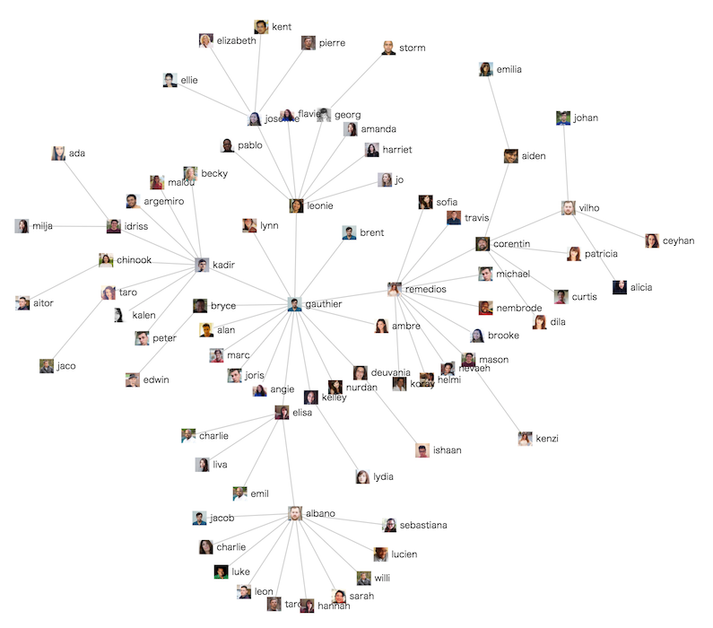

# slack-inviteviz

Visualizing an invitation graph of your slack team.

[日本語ドキュメント (Japanese)](README_ja.md)

Check a live demo here [https://slack-inviteviz-demo.knjcode.com](https://slack-inviteviz-demo.knjcode.com)



## Setup

Need owner or admin permission.

__1. Clone a repository__

```
$ git clone https://github.com/knjcode/slack-inviteviz
```

__2. Export invitations__

Export history of invitations automatically from your slack team's [Accepted invitations](https://my.slack.com/admin/invites#accepted) page. And save it as `accepted_invites.json` in your current directory.

```
$ cd slack-inviteviz
$ bundle install --path vendor/bundle
$ bundle exec ruby export.rb
Your slack team name(subdomain): xxxxxx
Login email: xxxx@xxxx.xxx
Login password(hidden): xxxxxxxxxx
Your two factor authentication code: xxxxxx
Saved!
```

__3. View an invitation graph in your browser__

Start a local server and open an invitation graph in your browser.

```
$ bundle exec rake server
```

Zoom out the browser if an invitation graph does not fit the screen dimensions.

## Remarks

Under the following conditions, an invitation graph is split.

- Disabled user exists. (Currently not possible to see who invited a disabled user.)
- Email signed up user exists. (If email sign up is enabled for your slack team, new members will be able to create an account on their own.)

## References

The automatic export script [export.rb](https://github.com/knjcode/slack-inviteviz/blob/master/export.rb) is based on the [import.rb](https://github.com/oti/slack-reaction-decomoji/blob/master/import.rb) of [slack-reaction-decomoji](https://github.com/oti/slack-reaction-decomoji).

Dummy user data are generated from the [RANDOM USER GENERATOR](https://randomuser.me/).

## LICENSE

The [export.rb](https://github.com/knjcode/slack-inviteviz/blob/master/export.rb) is licensed under [CC BY-NC 3.0](http://creativecommons.org/licenses/by-nc/3.0/deed.en).

The others are licensed under the MIT License.
