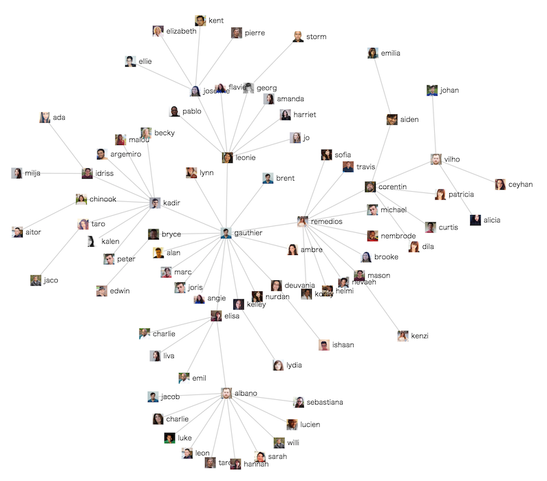

# slack-inviteviz

slackのinvite関係をツリー状に可視化します

ライブデモはこちら [https://slack-inviteviz-demo.knjcode.com](https://slack-inviteviz-demo.knjcode.com)



## セットアップ

OwnerまたはAdmin権限が必要です

__1. リポジトリのクローン__

```
$ git clone https://github.com/knjcode/slack-inviteviz
```

__2. invite履歴の取得__

以下のようにスクリプトを実行することで、slackの [Accepted invitations](https://my.slack.com/admin/invites#accepted) ページからinvite履歴データを抽出し、抽出したデータをカレントディレクトリに `accepted_invites.json` という名前で保存します。
あわせて、あなたのslackのteam名を `team_name.json` という名前で保存します。

```
$ cd slack-inviteviz
$ bundle install --path vendor/bundle
$ bundle exec ruby export.rb
Your slack team name(subdomain): xxxxxx
Login email: xxxx@xxxx.xxx
Login password(hidden): xxxxxxxxxx
Your two factor authentication code: xxxxxx
Saved!
```

__3. ブラウザで確認__

invite関係をツリー状に可視化しブラウザで開きます。

```
$ bundle exec rake server
```

ツリーが画面内に収まらない場合はブラウザ画面をズームアウトしてください。

## 備考

invite情報が無い(または取得できない)ためにツリーが分離する場合があります。

- Disabledのユーザがいる場合 (Disabledになったユーザを誰がinviteしたかという情報が取得できない)
- ドメイン指定されたメールアドレスを使ってinviteされることなくにteamにjoinしたユーザがいる場合


## 参考

invite情報の抽出スクリプト [export.rb](https://github.com/knjcode/slack-inviteviz/blob/master/export.rb) は [slack-reaction-decomoji](https://github.com/oti/slack-reaction-decomoji) の [import.rb](https://github.com/oti/slack-reaction-decomoji/blob/master/import.rb) を参考に作成しました。

ライブデモのダミーデータは [RANDOM USER GENERATOR](https://randomuser.me/) を利用して作成しています。

## ライセンス

[export.rb](https://github.com/knjcode/slack-inviteviz/blob/master/export.rb) は [CC BY-NC 3.0](https://creativecommons.org/licenses/by-nc/3.0/deed.ja) ライセンス。その他のコードは MIT ライセンスです。
